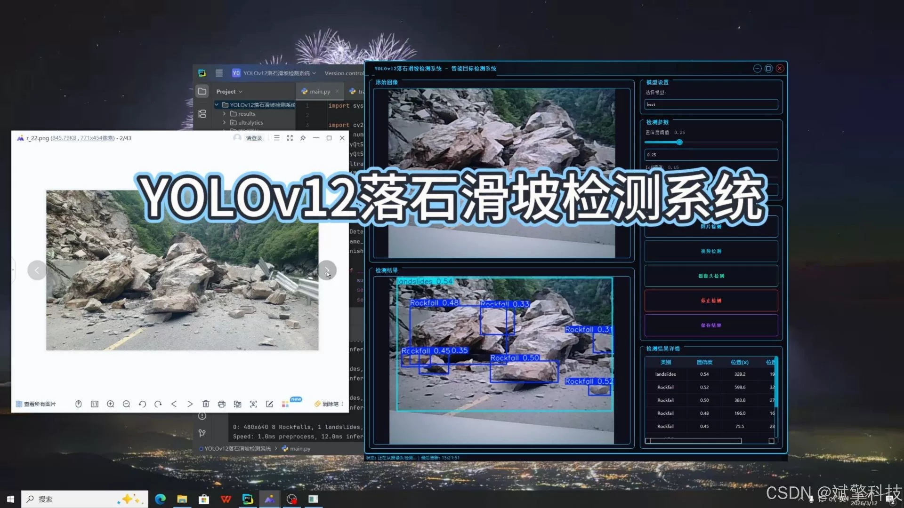
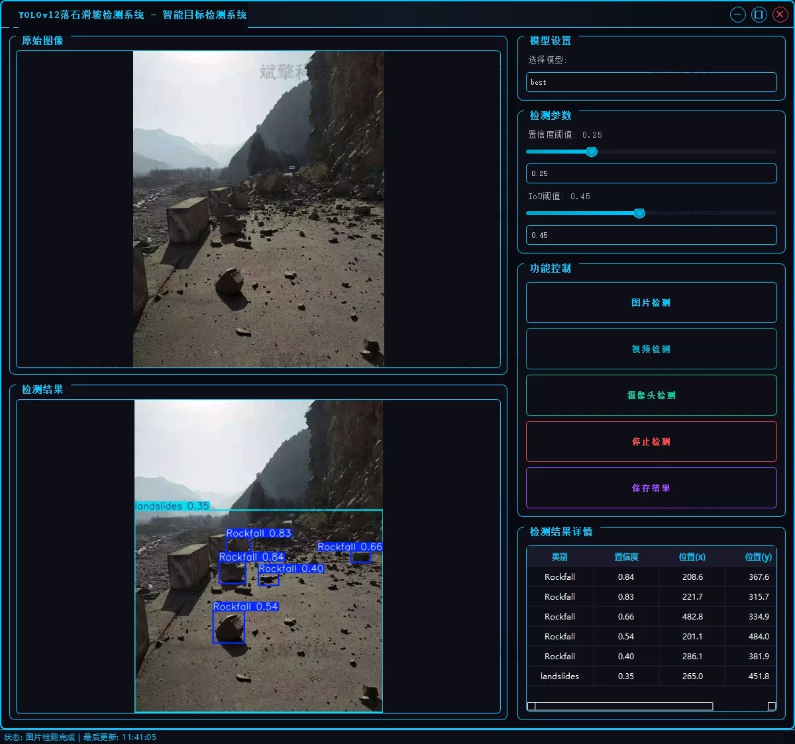
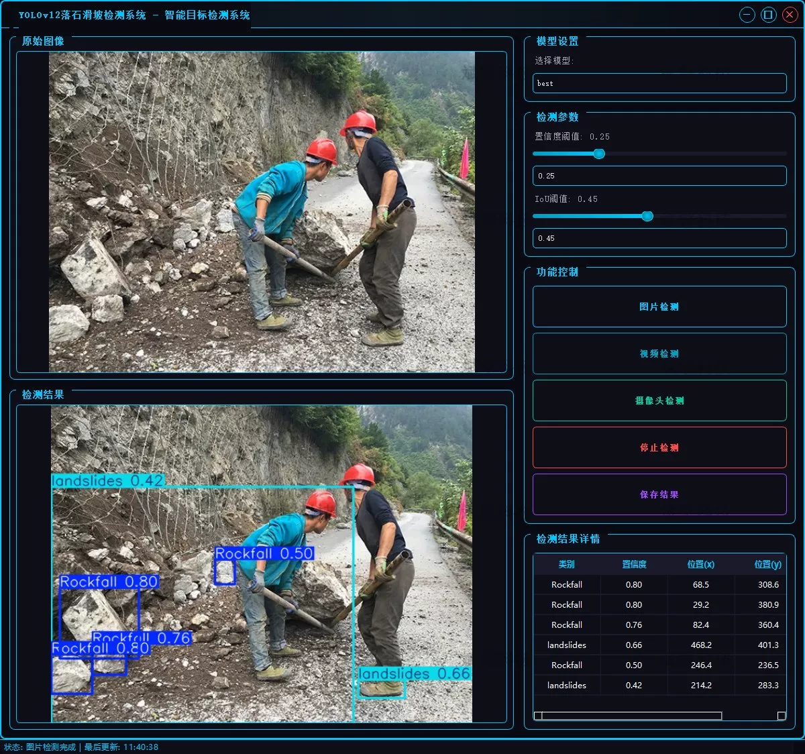
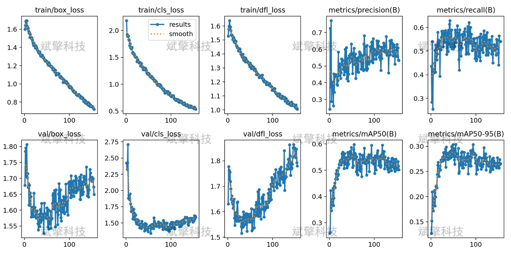

# Landslide detection system based on deep learning YOLOv12

## Body

Based on the deep learning algorithm YOLOv12, this project aims to develop a rockfall and landslide intelligent detection system. It is dedicated to solving the rapid recognition and localization of dynamic targets in geological disaster monitoring. The system is centered around computer vision and combined with the PyTorch deep learning framework. It has been optimized and trained for complex outdoor environments (such as lighting changes, vegetation obstruction, rocks color close to background, etc.).

The system implements three core functions: image detection supports fast analysis of single or multiple images; video detection can process each frame of the surveillance video stream and issue warnings; camera detection can access real-time monitoring scenes and achieve dynamic capture and immediate response. Experimental results show that the system has high detection accuracy while maintaining good real-time performance, providing effective technical support for the automation monitoring and early warning of geological disasters.

System Function Overview
✅ User login registration: Supports password verification and security validation.
✅ Three detection modes: Based on the YOLOv12 model, supports image, video, and real-time camera detection, accurately identifying targets.
✅ Dual-screen comparison: Displays the original scene and detection results on the same screen.
✅ Data visualization: Real-time table displaying the category, confidence, and coordinates of detected targets.
✅ Intelligent parameter adjustment: Provides a confidence slide bar to dynamically optimize detection accuracy, adapting to different scene needs.
✅ Sci-fi style interactive interface: Dark theme paired with dynamic light effects, reducing visual fatigue and improving operational experience.
✅ Multi-thread high-performance architecture: Independent detection threads ensure smooth operation, real-time status prompts, and quick response without lag.
Dataset Introduction
Training set: 810 images
Validation set: 90 images
Test set: 100 images

## Images

## Payment

Here is a pay link on Stripe ( https://buy.stripe.com/3cs8yP7sY87d0vu9AB ). Please contact me lonlonago@foxmail.com after funding $89, and I will send you a complete data files , thank you!

